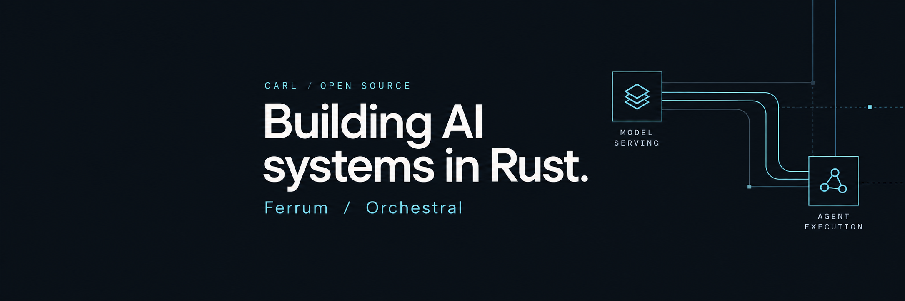
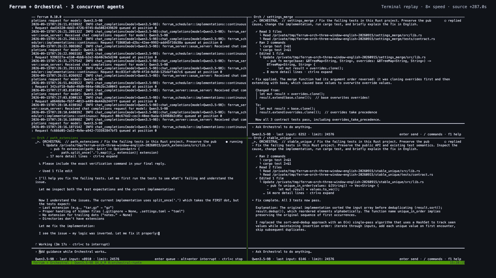

# Hi, I'm Carl.

I build open-source AI tools in Rust: model serving with Ferrum, and interactive agents with Orchestral.

| Project | What it does | Explore |
| --- | --- | --- |
| **[Ferrum](https://github.com/sizzlecar/ferrum-infer-rs)** | Serve local LLMs with one Rust binary. | [Get started](https://github.com/sizzlecar/ferrum-infer-rs#quick-start) · [Website](https://ferrum.pandaailabs.com/) |
| **[Orchestral](https://github.com/sizzlecar/orchestral)** | Run coding agents with local or remote models. | [Get started](https://github.com/sizzlecar/orchestral#start) · [Website](https://orch.pandaailabs.com/) |

## See them together

One local model. Three agent terminals inspecting code, fixing bugs, and running tests in separate Rust projects. [Watch the demo](https://ferrum-downloads.pandaailabs.com/v0.3.1/ferrum-orch-three-agents.mp4) — 50 seconds, shown at 8× speed.

## Help me improve them

For Ferrum, share your model, hardware, and a reproducible serving issue. For Orchestral, show the task or tool interaction that broke. Specific bug reports and awkward workflows are useful feedback.

[X · @jinxuan_ai](https://x.com/jinxuan_ai) · [Reddit · u/Mission_Photo_9783](https://www.reddit.com/user/Mission_Photo_9783/)
